## dp code

## 1.思维框架

动态规划的一般流程：

```text
暴⼒的递归解法 -> 带备忘录的递归解法 -> 迭代的动态规划解法
```

思考流程：

```text
找到状态和选择 -> 明确 dp 数组/函数的定义 -> 寻找状态之间的关系。
```

一般形式是求最值，核心问题就是穷举。


## 2.斐波那契数列问题

```java
// 暴力法
int fib(int N) {
    if (N == 1 || N == 2) return 1;
    return fib(N - 1) + fib(N - 2);
}

// 带备忘录
class Solution {
    public int fib(int N) {
        if (N < 1) return -1;
        // 备忘录法
        Map<Integer,Integer> memo = new HashMap<>();
        return helper(memo,N);
    }

    public int helper(Map<Integer, Integer> memo, int n) {
        if (n == 1 || n ==2) return 1;
        if (memo.containsKey(n)) return memo.get(n);
        memo.put(n,helper(memo,n - 1) + helper(memo, n - 2));
        return memo.get(n);
    }
}

// dp table
class Solution {
    public int fib(int N) {
        if (N < 1) return -1;
        int[] dp = new int[N + 1];
        dp[1] = 1;
        dp[2] = 1;
        for (int i = 3; i <=N; i++) {
            dp[i] = dp[i - 1] + dp[i - 2];
        }
        return dp[N];
    }
}

// 优化空间复杂度，只有两个状态
class Solution {
	public int fib(int n) {
        if (n == 2 || n == 1)
            return 1;
        int prev = 1, curr = 1;
        for (int i = 3; i <= n; i++) {
            int sum = prev + curr;
            prev = curr;
            curr = sum;
        }
        return curr;
    }
}
```


## 3.零钱兑换

[leetcode-322](<https://leetcode-cn.com/problems/coin-change/>)

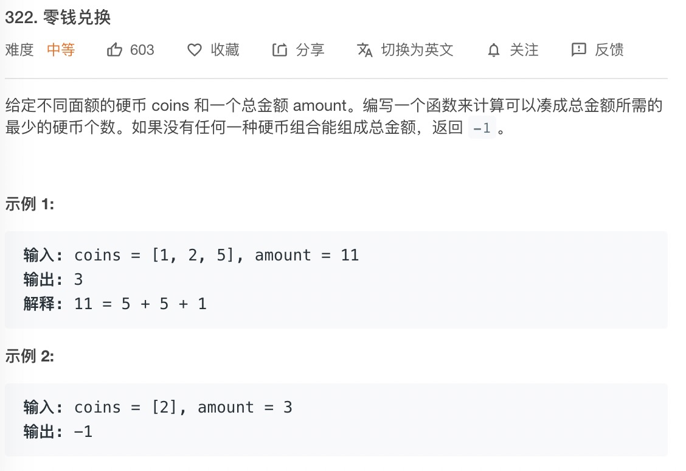

```java
class Solution {
    public int coinChange(int[] coins, int amount) {
        int[] dp = new int[amount + 1];
        // 给dp一个初始值，要大于最极端情况下coin=1，需要兑换的次数为amount的值。
        Arrays.fill(dp,amount + 1);
        dp[0] = 0;
        for (int i = 1; i <= amount; i++) {
            for(int coin: coins) {
                // 子问题无解，可以直接跳过
                if ((i - coin) < 0) continue;
                // 状态转移方程： dp[i] = min(dp[i], 1 + dp[i - coin])
                dp[i] = Math.min(dp[i], 1 + dp[i - coin]);
            }
        }
        // 如果结果还是等于初始值，说明没有成功兑换，返回-1，小trick
        return (dp[amount] == amount + 1) ? -1 : dp[amount];
    }
}
```

### 3.2 同类型问题，最低票价

[leetcode-983](<https://leetcode-cn.com/problems/minimum-cost-for-tickets/>)

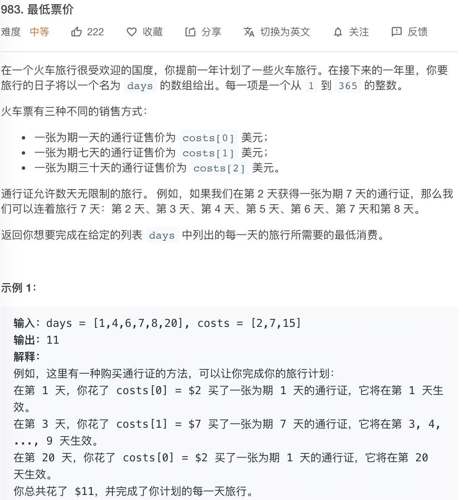

```java
class Solution {
    public int mincostTickets(int[] days, int[] costs) {
        // dp[n] 表示第n天需要的最低消费
        int[] dp = new int[days[days.length - 1] + 1];
        int days_idx = 0;
        for (int i = 1; i < dp.length; i++) {
            // 若当前天数不是待处理天数，则其花费费用和前一天相同
            if(i != days[days_idx]) dp[i] = dp[i - 1];
            // 若当前天数是待处理天数，则其花费费用是3种情况的最小值
            else {
                dp[i] = Math.min(Math.min(dp[Math.max(0, i - 1)] + costs[0], 
                              dp[Math.max(0, i -7)] + costs[1]),
                              dp[Math.max(0, i - 30)] + costs[2]);
                days_idx++;
            }
            
        }
        return dp[dp.length - 1];
    }
}
```


## 4.最长上升子序列

[leetcode-300](<https://leetcode-cn.com/problems/longest-increasing-subsequence/>)

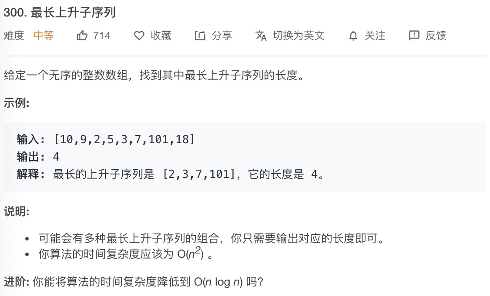

```java
class Solution {
    // o(n^2)
    public int lengthOfLIS(int[] nums) {
        // dp 该位置的上升子序列的个数
        int[] dp = new int[nums.length];
        // dp都置为1，数字本身也是上升子序列
        Arrays.fill(dp,1);
        for (int i = 1; i < dp.length; i++) {
            for (int j = 0; j < i; j++) {
                if(nums[i] > nums[j]) {
         // 状态转移方程：遍历小于i的部分，一旦有nums[i] > nums[j]，dp[i] = max(dp[i],dp[j] +1)
                    dp[i] = Math.max(dp[i], dp[j] + 1);
                }
            }
        }
        int res = 0;
        for (int ele: dp) {
            res = Math.max(res, ele);
        }
        return res;
    }
}

// 优化解法 二分找位置
class Solution {
    public int lengthOfLIS(int[] nums) {
        int[] top = new int[nums.length];
        int res = 0;
        for(int num: nums) {
            int left = 0, right = res;
            // 二分查找求左侧边界
            while (left < right) {
                int mid = (left + right) / 2;
                if (top[mid] < num) left = mid + 1;
                else right = mid;
            }
      // case1: num < top[-1] 需要在top中找位置，找第一个使top[i] > num的i的位置替换，更小的top[i]值可以使后面上升子序列的值更长的可能性更大
      // case2: num > top[-1] 上面二分找不到 left = right，终止查找，此时会将num加到top的最后(top[left]表示top中有left+1个元素)
            top[left] = num;
            // right = res，说明二分查找没找到，需要res++
            if(res == right) res++;
        }
        return res;
    }
}
```


## 5.编辑距离

处理这种两个字符串的动态规划问题：

一般都是指定两个指针，从头往后走，一步步缩小范围。

**遍历顺序说明**

两条原则：

```text
1.遍历的过程中，所需的状态必须是已经计算出来的。(保证无后效性)
2.遍历的终点必须是存储结果的那个位置。
```

据此分析这一题：

```text
初始状态dp[0][0...n]/dp[0...n][n]
最终状态dp[m][n]
此时遍历顺序可以是正向遍历：

for(int i = 1; i < m; i++) {
    fot(int j = 1; j < n; j++) {
        if(s[i-1] == s[j-1]) dp[i][j] = dp[i-1][j-1];
        else dp[i][j] = max(dp[i-1][j],dp[i][j-1],dp[i-1][j-1]);
    }
}
```


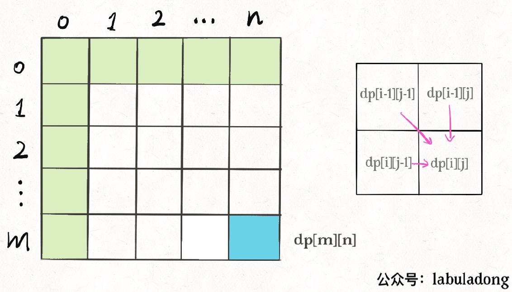

[leetcode-72](<https://leetcode-cn.com/problems/edit-distance/>)

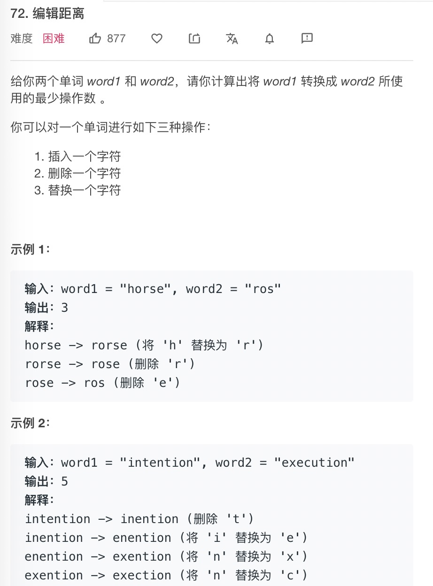


```java
class Solution {
    public int minDistance(String word1, String word2) {
        int m = word1.length(), n = word2.length();
        // dp[m][n] 表示长度为m的word1、长度为n的word2需要操作的步骤
        int[][] dp = new int[m + 1][n + 1];
        // 另外一个字符为空的情况单独列出来
        for(int i = 1; i <= m; i++) dp[i][0] = i;
        for(int j = 1; j <= n; j++) dp[0][j] = j;
        for(int i = 1; i <= m; i++) {
            for(int j = 1; j<= n; j++) {
                // 如果字符相等，直接跳过
                if (word1.charAt(i - 1) == word2.charAt(j -1)) dp[i][j] = dp[i - 1][j - 1];
                // dp[i][j-1] 表示word1插入了一个与word2[j]相等的字符，之后j前移再跟word1比较
                // dp[i-1][j] 表示word1删除字符，前移i再跟word2比较
                // dp[i-1][j-1] 表示替换word1p[i]使之与word2[j]相等
                else dp[i][j] = Math.min(Math.min(dp[i][j - 1] + 1,dp[i - 1][j] + 1),dp[i - 1][j - 1] +1);
            }
        }
        return dp[m][n];
    }
```


### 5.2 最长公共子序列

[leetcode-1143](<https://leetcode-cn.com/problems/longest-common-subsequence/>)

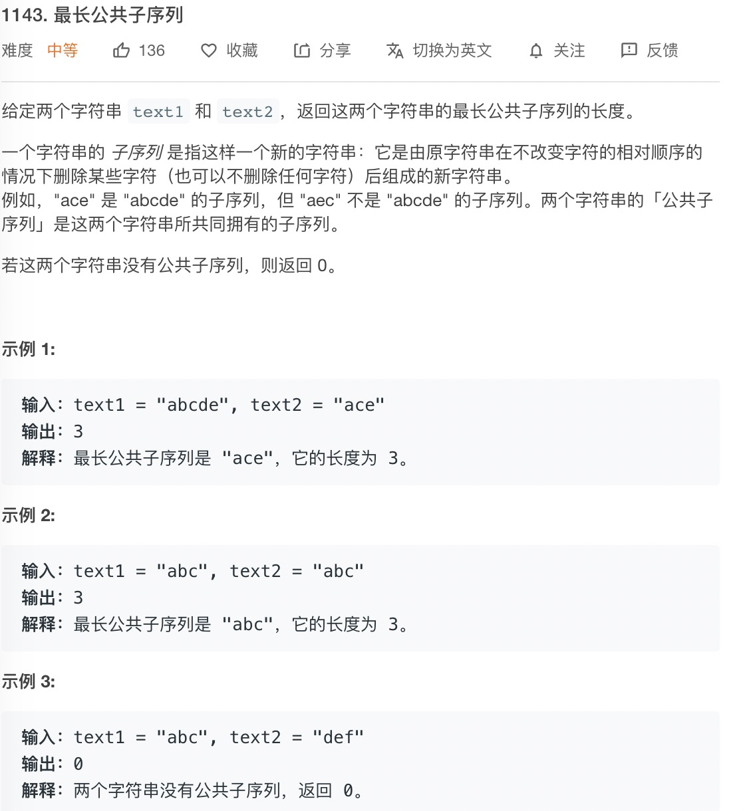

**遍历顺序**

```text
初始状态dp[0][0]
最终状态dp[m][n]
正向遍历即可保证无后效性
```


```java
class Solution {
    public int longestCommonSubsequence(String text1, String text2) {
        int m = text1.length(), n = text2.length();
        int[][] dp = new int[m + 1][n + 1];
        for (int i = 1; i <= m; i++) {
            for (int j = 1; j <= n; j++) {
                // 如果相等，加1，注意这里下标是i-1
                if (text1.charAt(i - 1) == text2.charAt(j - 1)) dp[i][j] = dp[i -1][j - 1] + 1;
                // 此处不需要考虑dp[i-1][j-1]，因为这个肯定比另外两种情况小
                else dp[i][j] = Math.max(dp[i][j - 1],dp[i - 1][j]);
            }
        }
        return dp[m][n];
    }
}
```


### 5.3 最长回文字符串

[leetcode-5](<https://leetcode-cn.com/problems/longest-palindromic-substring/>)

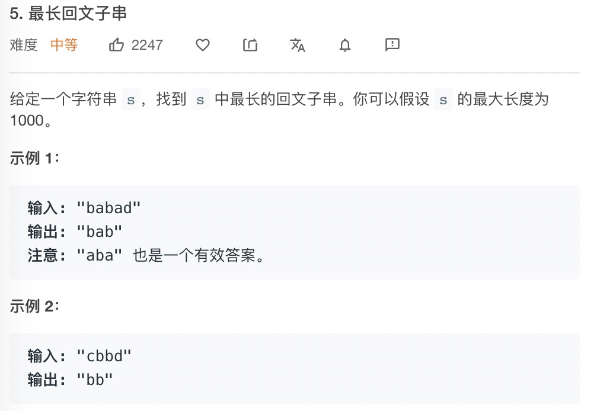

**遍历顺序**

```text
初始状态dp[i][i] = true
最终状态dp[len-1][len-1]
可以正向遍历
```


```java
class Solution {
    public String longestPalindrome(String s) {
        // 特判
        int len = s.length();
        if (len < 2) return s;
        // dp[i][j] 表示s[i...j]是否是回文字符串
        boolean[][] dp = new boolean[len][len];
        for(int i =0; i < len; i++) {
            dp[i][i] = true;
        }
        int maxLen = 1, start = 0;
        for(int j = 1; j < len; j++) {
            for (int i = 0; i < j; i++) {
                if (s.charAt(i) != s.charAt(j)) dp[i][j] = false;
                else {
                    // j-1-(i+1)+1=j-i-1<2 --> j-i<3 s[i+1....j-1]长度小于2，dp[i][j]肯定是true了
                    if (j -i < 3) dp[i][j] = true;
                    else dp[i][j] = dp[i+1][j-1];
                }
                if (dp[i][j] && (j -i + 1) > maxLen) {
                    maxLen = j -i +1;
                    start = i;
                }
            }
        }
        return s.substring(start,start+maxLen);
    }
}
```


### 5.4 最长回文子序列

[leetcode-516](<https://leetcode-cn.com/problems/longest-palindromic-subsequence/>)

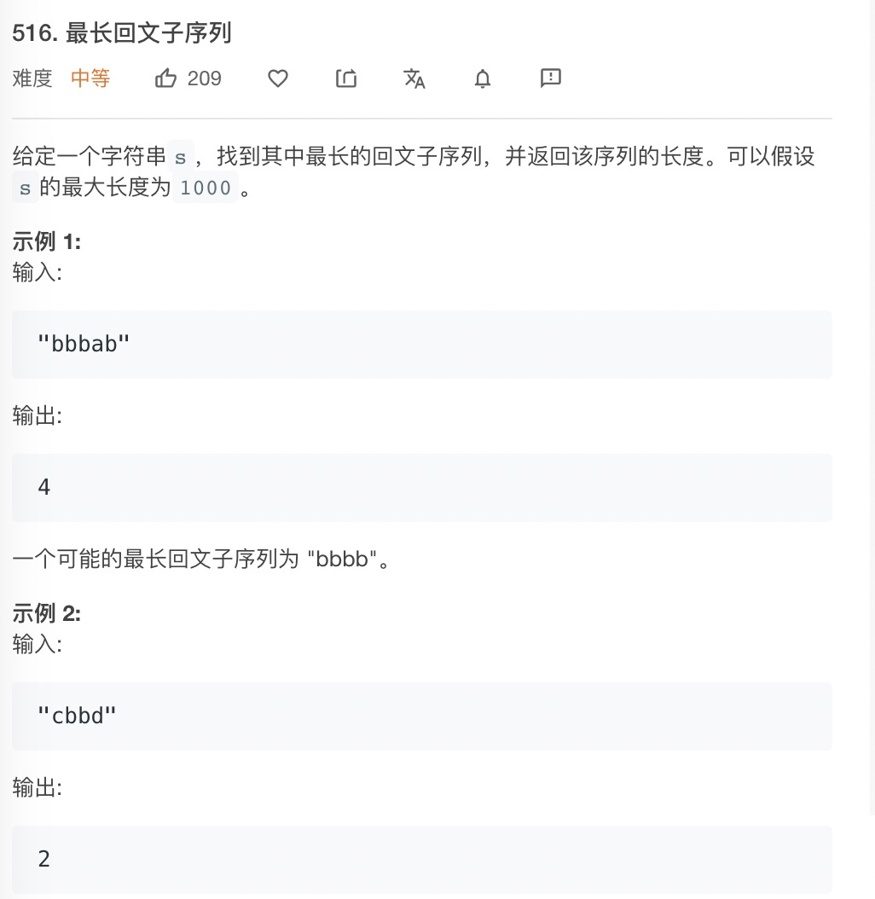

**遍历顺序**

```text
初始状态dp[i][i] = 1
最终状态dp[0][n-1]
反向遍历

for (int i = n - 1; i >= 0; i--) {
    for (int j = i + 1; j < n; j++) {
        // 状态转移⽅程
        if (s[i] == s[j]) dp[i][j] = dp[i + 1][j - 1] + 2;
        else dp[i][j] = max(dp[i + 1][j], dp[i][j - 1]);
    }
}
```


```java
class Solution {
    public int longestPalindromeSubseq(String s) {
        int len = s.length();
        int[][] dp = new int[len][len];
        // 初始状态
        for(int i = 0; i < len; i++) {
            dp[i][i] = 1;
        }
        // 反向遍历
        for (int i = len - 1; i >= 0; i--) {
            for (int j = i + 1; j < len; j++) {
                if(s.charAt(i) == s.charAt(j)) dp[i][j] = dp[i+1][j-1] + 2;
                else dp[i][j] = Math.max(dp[i+1][j],dp[i][j-1]);
            }
        }
        return dp[0][len-1];
    }
}
```

### 5.5 回文子串

[leetcode-647](<https://leetcode-cn.com/problems/palindromic-substrings/>)

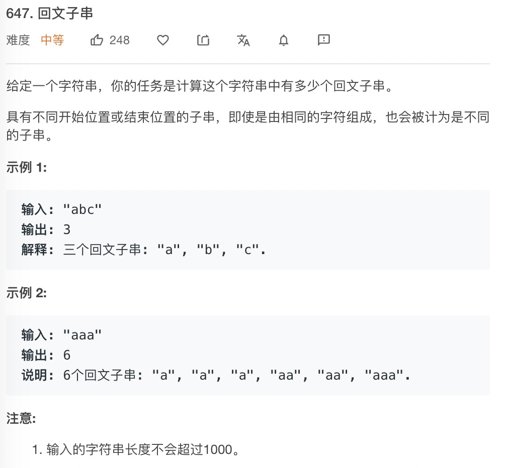

**遍历顺序**

```text
初始状态dp[i][i]=true
最终状态dp[0][n-1]  
由于dp[i][j] 要由dp[i+1][j-1]来求，所以用反向遍历
```


```java
class Solution {
    public int countSubstrings(String s) {
        int len = s.length(), res = 0;
        boolean[][] dp =new boolean[len][len];
        for (int i = 0; i < len; i++) {
            dp[i][i] = true;
            res++;
        }
        // 最终求dp[0][len-1] 可以反向遍历
        for(int i = len - 1; i >= 0; i--) {
            for (int j = i + 1; j < len; j++) {
                // if (s.charAt(i) == s.charAt(j)) {
                //     if ((j - i) < 3) {
                //         dp[i][j] = true;
                //         res++;
                //     } else {
                //         dp[i][j] = dp[i+1][j-1];
                //     }
                // }
                if (s.charAt(i) == s.charAt(j) && (j-i<3 || dp[i+1][j-1])) {
                    dp[i][j] = true;
                    res++;
                }
            }
        }
        return res;
    }
}
```


## 6.打家劫舍

### 6.1 打家劫舍1

[leetcode-198](<https://leetcode-cn.com/problems/house-robber/>)

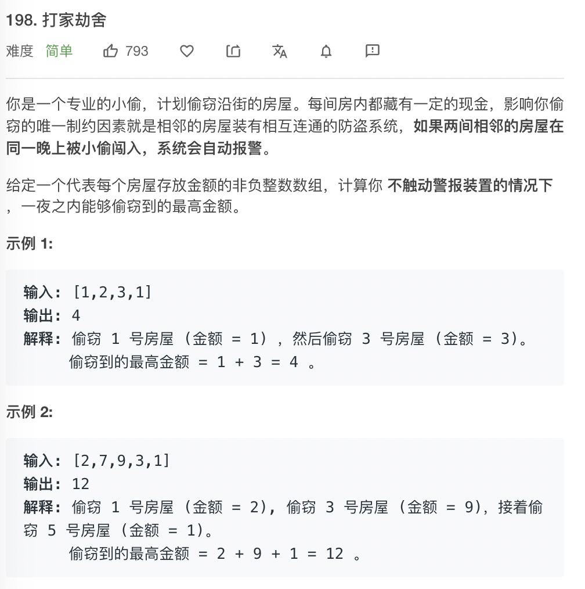

**分析**

```text
dp[i] = max(dp[i-1],dp[i-2]+nums[i-2])
```


```java
class Solution {
    public int rob(int[] nums) {
        int n = nums.length;
        // 从前往后看是比较麻烦的，要考虑0、1、2三种情况
        if (n <= 1) return n == 0 ? 0: nums[0];
        int dp_0 = nums[0], dp_1 = Math.max(nums[0],nums[1]);
        int dp_2 = n == 2 ? dp_1 : 0;
        for (int i = 2; i < n; i++) {
            dp_2 = Math.max(dp_1,dp_0+nums[i]);
            dp_0 = dp_1;
            dp_1 = dp_2;
        }
        return dp_2;
    }
}

// 从后往前看比较好，不用判断n=0、1两种特殊情况
class Solution {
    public int rob(int[] nums) {
        int n = nums.length;
        // dp可以加两个位置，dp[i+1]/dp[i+2]
        int dp_i_1 = 0, dp_i_2 = 0;
        // 记录 dp[i]
        int dp_i = 0;
        for (int i = n - 1; i >= 0; i--) {
            dp_i = Math.max(dp_i_1, nums[i] + dp_i_2);
            dp_i_2 = dp_i_1;
            dp_i_1 = dp_i;
        }
        return dp_i;
    }
}
```

### 6.2 打家劫舍2

[leetcode-213](<https://leetcode-cn.com/problems/house-robber-ii/>)

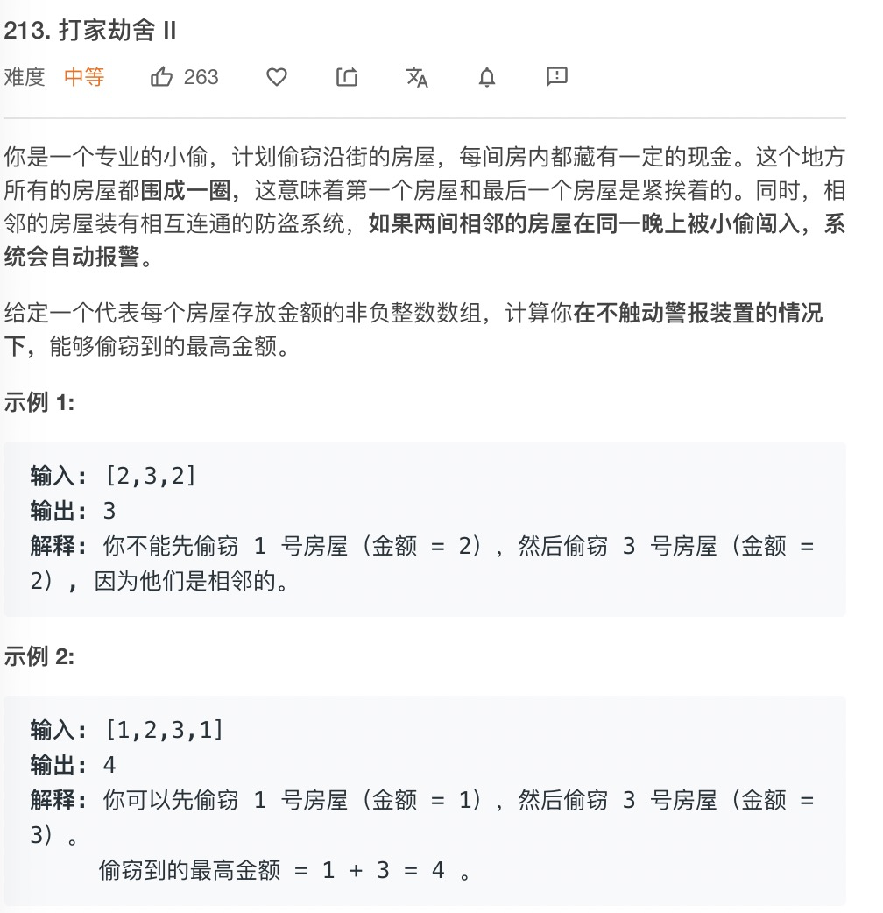

**分析**

```text
跟第一题对比看，围成圈的结果是求[0...n-2] 和[1...n-1]中的最大值
基础状态方程不改变：dp[i] = max(dp[i-1]+dp[i-2]+nums[i])
```


```java
class Solution {
    public int rob(int[] nums) {
        int n = nums.length;
        if (n <= 1) return n == 0 ? 0 : nums[0];
        // 需要取[0...n-2]、[1...n-1]中的最大值
        return Math.max(robRange(nums,0,n-2),robRange(nums,1,n-1));
    }
    int robRange(int[] nums,int start,int end) {
        int n = nums.length;
        int dp_i_1 = 0, dp_i_2 = 0, dp_i = 0;
        for (int i=end;i>=start;i--) {
            dp_i = Math.max(nums[i]+dp_i_2,dp_i_1);
            dp_i_2 = dp_i_1;
            dp_i_1 = dp_i;
        }
        return dp_i;
    }
}
```


### 6.3 打家劫舍3

[leetcode-337](<https://leetcode-cn.com/problems/house-robber-iii/>)

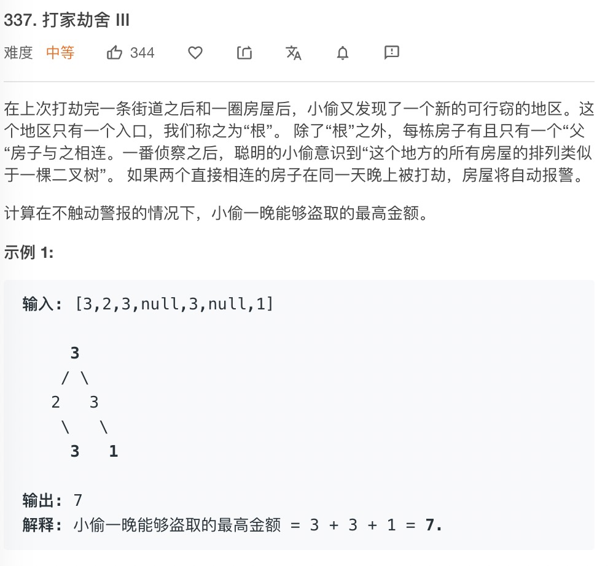

**分析**

```text
针对root，抢跟不抢进行区分
抢: root.val + rob(root.left.left) + rob(roob.left.right)
不抢: rob(root.left) + rob(root.right)
```


```java
class Solution {
    Map<TreeNode, Integer> memo = new HashMap<>();

    public int rob(TreeNode root) {
       if(root == null) return 0;
       if(memo.containsKey(root)) return memo.get(root);
       // do_it
       int do_it = root.val + (root.left == null ? 0 : rob(root.left.left) + rob(root.left.right)) 
                            + (root.right == null ? 0 : rob(root.right.left) + rob(root.right.right));
       // not_do
        int not_do = rob(root.left) + rob(root.right);
        int res = Math.max(do_it,not_do);
        memo.put(root,res);
        return res; 
    }
}

// 构造数组res res[0]表示不抢root，res[1]表示抢root
class Solution {
    public int rob(TreeNode root) {
        int[] res = dp(root);
        return Math.max(res[0],res[1]);
    }

    public int[] dp(TreeNode root) {
        if (root == null) return new int[]{0,0};
        int[] left = dp(root.left);
        int[] right = dp(root.right);
        // do_it，下家就不抢了
        int do_it = root.val + left[0] + right[0];
        // not_do 下家可抢可不抢，需要自己做判断
        int not_do = Math.max(left[0],left[1]) + Math.max(right[0],right[1]);
        return new int[]{not_do,do_it};
    }
}
```


## 7.高楼扔鸡蛋

[leetcode-887](<https://leetcode-cn.com/problems/super-egg-drop/>)

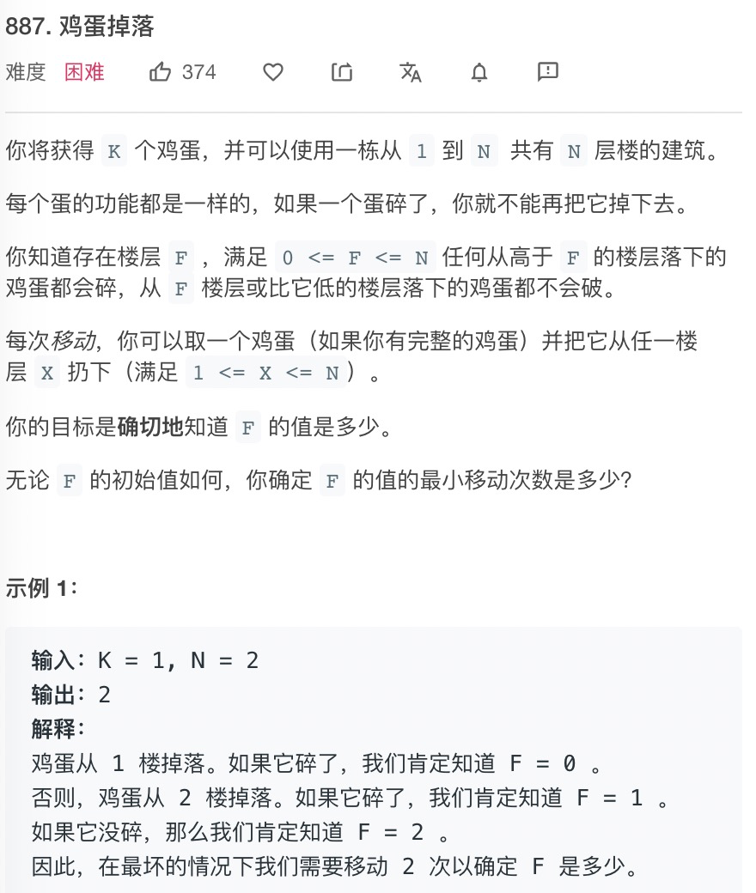

**分析**

```text
在第i层扔鸡蛋的伪码
for(int i = 1; i <= N; i++) {
    res =Math.min(res, 第层扔鸡蛋的情况);
}
第i层扔鸡蛋有两种可能：
1）鸡蛋碎了，此时K-1，搜索楼层由[1...N]变成[1...i-1]共i-1层
2）鸡蛋没碎，此时K不变，搜索楼层由[1...N]变成[i+1...N]共N-i层
即：
for(int i = 1; i <= N; i++) {
    res =Math.min(res, Math.max(dp(K-1,i-1),dp(K,N-i)) + 1);
}
```


```java
// 带备忘录的解法
class Solution {
    Map<Integer,Integer> memo = new HashMap<>();
    public int superEggDrop(int K, int N) {
        return dp(K,N);
    }

    public int dp(int K, int N) {
        if(K == 1) return N;
        if(N == 0) return 0;
        if (memo.containsKey(N * 1000 + K)) return memo.get(N * 1000 + K); // K <= 100，这样肯定能唯一
        int left = 1, right = N, res = Integer.MAX_VALUE;
        for(int i = 1; i<= N; i++) {
            res = Math.min(res, Math.max(dp(K-1,i-1),dp(K,N-i)) + 1);
        }
        // 记入备忘录
        memo.put(N * 1000 + K,res);
        return res;
    }
}

// 用二分法来做一点优化，相当于求最大值中的最小值，相当于求山谷值
class Solution {
    Map<Integer,Integer> memo = new HashMap<>();
    public int superEggDrop(int K, int N) {
        return dp(K,N);
    }

    public int dp(int K, int N) {
        if(K == 1) return N;
        if(N == 0) return 0;
        if (memo.containsKey(N * 1000 + K)) return memo.get(N * 1000 + K);
        int left = 1, right = N, res = Integer.MAX_VALUE;
        // 这种写法想不到...
        while (left <= right) {
            int mid = (left + right) / 2;
            int broken = dp(K - 1, mid - 1); // 碎了
            int not_broken = dp(K, N - mid); // 没碎
            if(broken > not_broken) {
                right = mid - 1;
                res = Math.min(res, broken + 1);
            } else {
                left = mid + 1;
                res = Math.min(res, not_broken + 1);
            }
        }
        memo.put(N * 1000 + K,res);
        return res;
    }
}
```

