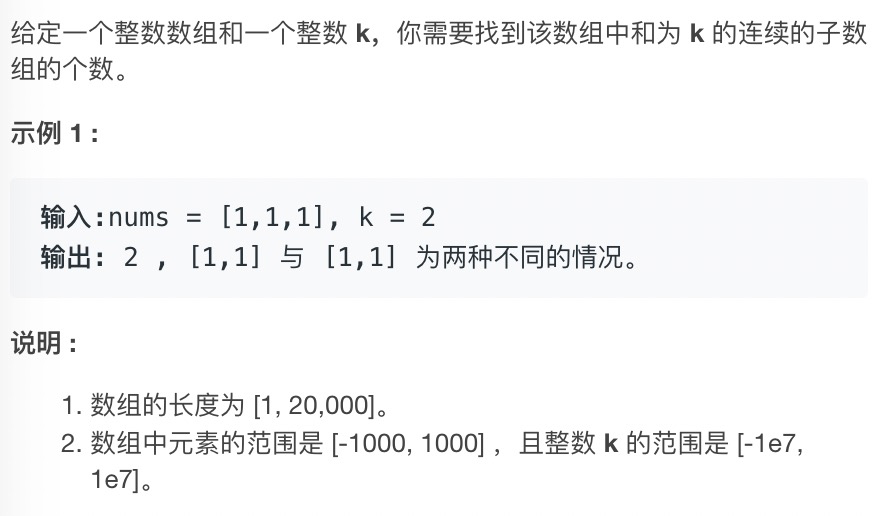
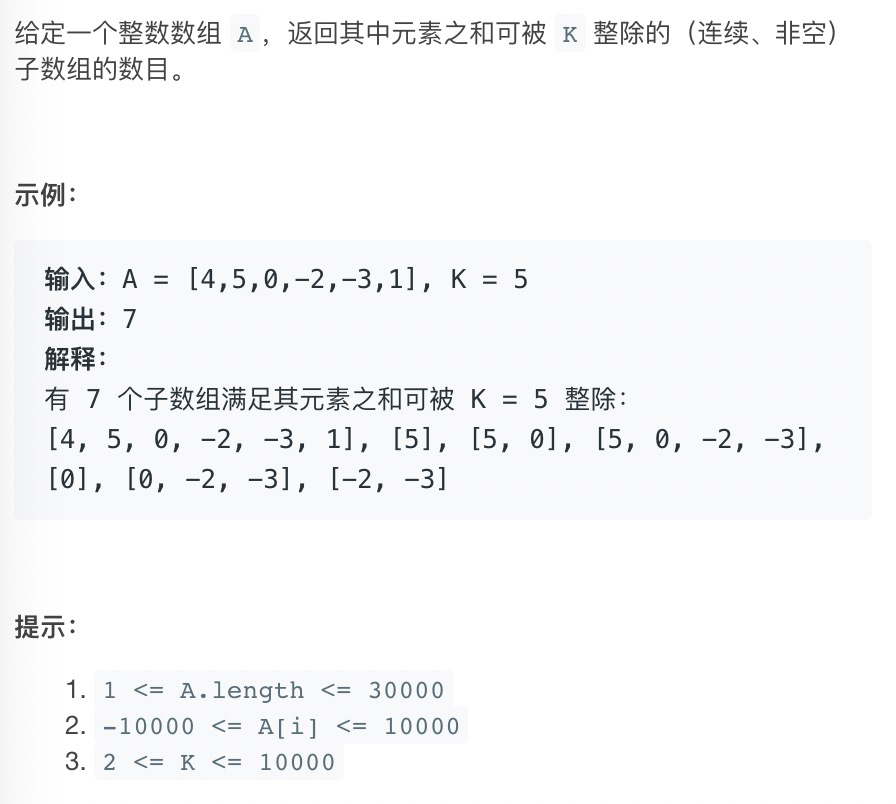
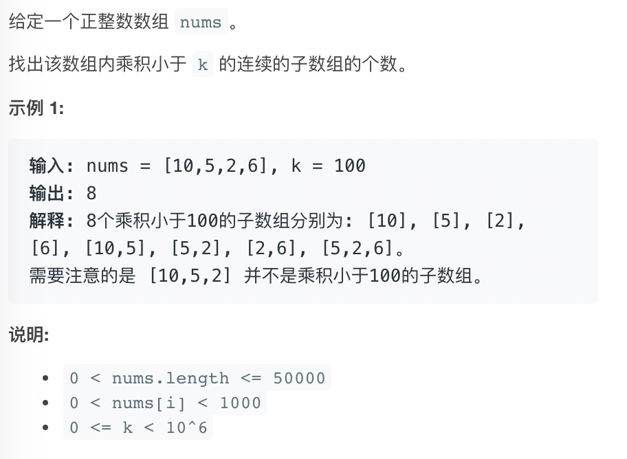

# 前缀和系列

**定义**

```text
前缀和：从第0项到当前项的总和
prefixNum[x] = nums[0] + nums[1] + ... + nums[x]
nums[x] = prefixNum[x] - prefixNum[x-1]
```

**框架**

```text
一般不关心前缀和的位置，只关心前缀和的值和出现次数。
用map来存前缀和和出现次数。
```


## 1.[和为K的子数组](https://leetcode-cn.com/problems/subarray-sum-equals-k/)



**分析**

```text
map中存放的是<sum,sum出现的次数>
```


```java
class Solution {
    public int subarraySum(int[] nums, int k) {
        Map<Integer,Integer> record = new HashMap<>();
        // 前缀和为0的次数是1
        record.put(0,1);
        int sum = 0, count = 0;
        for(int num: nums) {
            sum += num;
            // prefixSum[i] - prefixSum[j] = k
            if (record.containsKey(sum - k)) count += record.get(sum - k);
            record.put(sum, record.getOrDefault(sum, 0) + 1);
        }
        return count;
    }
}
```


## 2.[ 和可被 K 整除的子数组](https://leetcode-cn.com/problems/subarray-sums-divisible-by-k/)



**分析**

```text
map中存放的是<sum%k,sum%k出现的次数>
```


```java
class Solution {
    public int subarraysDivByK(int[] A, int K) {
        Map<Integer,Integer> dic = new HashMap<>();
        dic.put(0,1); // 依旧是前缀和为0的次数是1
        int res = 0, sum = 0;
        for (int num: A) {
            sum += num;
            int modules = Math.floorMod(sum,K);
            int cnt = dic.getOrDefault(modules,0);
            res += cnt;
            dic.put(modules, cnt + 1);
        }
        return res;
    }
}
```


## 3.[乘积小于K的子数组](https://leetcode-cn.com/problems/subarray-product-less-than-k/)




```java
class Solution {
    public int numSubarrayProductLessThanK(int[] nums, int k) {
        if (k <= 1) return 0;
        int prod = 1, ans = 0, left = 0;
        for (int right = 0; right < nums.length; right++) {
            prod *= nums[right];
            // 如果累积大于k，需要移动左指针
            while (prod >= k) prod /= nums[left++];
            // 为避免重复，只取包含数字的子串
            ans += (right - left + 1);
        }
        return ans;
    }
}
```

