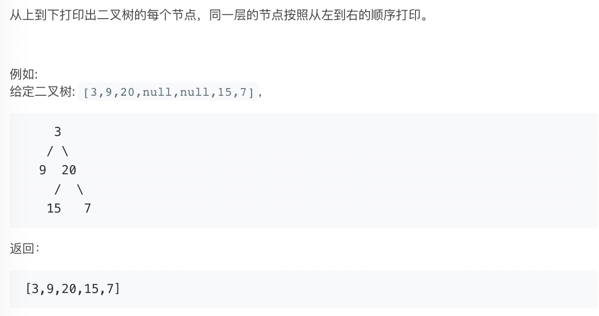
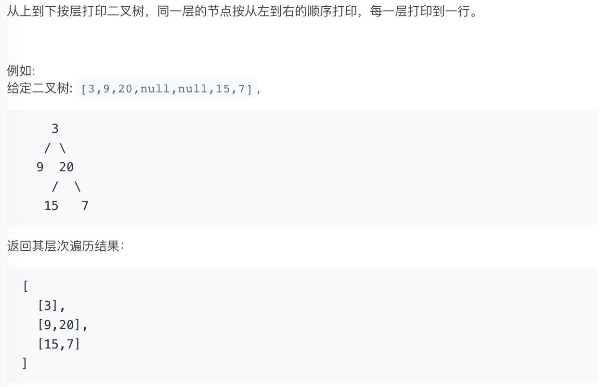

## 32-34.层序打印二叉树

分析

```text
按照层次打印二叉树，本质上都是采用BFS，基本框架如下：
 Queue<TreeNode> queue = new LinkedList<TreeNode>();
 List<Integer> list = new ArrayList<Integer>();
 // 将root节点添加进queue，作为第一层
 queue.add(root);
 while(!queue.isEmpty()) {
     TreeNode node = queue.poll();
     list.add(node.val);
     if (node.left != null) queue.add(node.left);
     if (node.right != null) queue.add(node.right);
 }
```


### 32.从上到下打印二叉树I



```java
class Solution {
    public int[] levelOrder(TreeNode root) {
        Queue<Integer> queue = new LinkedList<>();
        List<Integer> res = new ArrayList<>();
        queue.add(root);
        while (!queue.isEmpty()) {
            TreeNode node = queue.poll();
            res.add(node.val);
            if (node.left != null) queue.add(node.left);
            if (node.right != null) queue.add(node.right);
        }
        // 这里一定要会啊，
        return res.stream().mapToInt(Integer::intValue).toArray();
    }
}
```


### 33.从上到下打印二叉树II




```java
// 需要考虑层级
class Solution { 
    public List<List<Integer>> levelOrder(TreeNode root) {
        Queue<TreeNode> queue = new LinkedList<>();
        List<List<Integer>> res = new ArrayList<>();
        queue.add(root);
        while (!queue.isEmpty()) {
            
        }
    }
}
```


## 40.最小的k个数

分析

```text
典型的top k问题
最小k个数用最大堆，即左右节点值都小于根节点，这样新元素加进去会去匹配左右节点值
最大k个数用最小堆，即左右节点值都大于根节点
```


```java
class Solution {
    public int[] getLeastNumbers(int[] arr, int k) {
        if (k == 0 || arr.length == 0) {
            return new int[0];
        }
        // 构建最大堆，需要进行重写操作
        Queue<Integer> pq = new PriorityQueue<>(k,(v1,v2) -> v2 - v1);
        for (int num: arr) {
            if (pq.size() < k) {
                pq.offer(num);
            } else if (pq.peek() > num) {
                    pq.poll();
                    pq.offer(num);
            }
        }
        // 返回堆中元素
        int[] res = new int[k];
        int idx = 0;
        for(int num: pq) {
            res[idx++] = num;
        }
        return res;
    }
}
```

